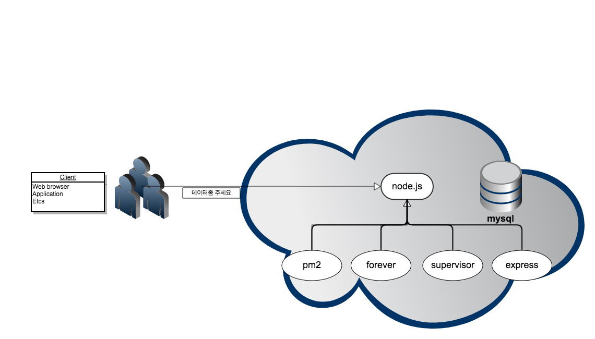

# 1주차 강의

node.js 1주차 강의자료.

개발환경 셋팅 및 자바스크립트 맛보기.

## 목차

1. 개발환경 구축
    
    1.1 node.js 설치하기
    
    1.2 editor 설치하기(atom)
    
    1.3 MySQL 설치하기
    
2. npm 사용법
    
    2.1필요모듈 설치하기 
    
3. 간단한 javascript 작성해보기

    3.1 console.log 사용
    
    3.2 변수생성
    

## node.js란?

시작을 하기 앞서서 node.js가 무엇인지부터 알고 시작하자!

[node.js란-1?](http://asfirstalways.tistory.com/43)
[node.js란-2?](http://asfirstalways.tistory.com/43)

결과론적으로 node.js는 javascript 기반을 된 서버 사이드를 작성할 수 있도록 도와주는 엔진입니다.


## 1. 개발환경 구축

### 1.1. node.js 설치하기

[node.js 설치](https://nodejs.org/ko)

* `설치확인`
    
    ```bash
    $ node --version
    v6.9.2
    $ npm --version
    3.10.9
    ```

터미널창에서 위와같이 출력이 되면 정상적으로 설치가 된 것이다.
버전이 다르게 뜨는것은 신경쓸 필요가 없음.

### 1.2. editor 설치하기

[editor 설치](https://atom.io)

> editor는 굳이 atom을 설치할 필요가 없음. 개인이 편하게 사용하는 tool, editor가 있으면 그대로 사용해도 무관.

### 1.3. MySQL 설치하기
[MySQL 설치](https://dev.mysql.com/downloads/mysql)


* `MySQL 설치 참고`

    [window](http://withcoding.com/26) 참고

    [mac](http://palpit.tistory.com/871) 참고


## 2. npm 사용법

npm은 node package manager의 약자로 node.js에서 사용되는 모듈을 관리해주는 도구

### 2.1 모듈설치 해보기

```bash
$ npm install -g forever
$ npm install -g supervisor
$ npm install -g express-generator
$ npm install -g express
$ npm install -g mysql
```

npm install [패키지 이름]의 형태로 모듈 설치가 가능하다.
단, 여기서 -g는 global의 약자로 해당 pc에서 어느 경로에서나 사용이 가능할 수 있도록 붙여주었다.

특히 forever, supervisor, express-generator는 반드시 -g를 붙여서 설치를 해주도록 한다.
mysql, express는 굳이 -g를 붙일 필요가 없다.

### 2.2 설치된 모듈 확인하기

```bash

$ forever --version
v0.15.3


$ supervisor --version

Node Supervisor is used to restart programs when they crash.
It can also be used to restart programs when a *.js file changes.

Usage:
  supervisor [options] <program>
  supervisor [options] -- <program> [args ...]

Required:
  <program>
    The program to run.

Options:
  -w|--watch <watchItems>
    A comma-delimited list of folders or js files to watch for changes.
    When a change to a js file occurs, reload the program
    Default is '.'

  -i|--ignore <ignoreItems>
    A comma-delimited list of folders to ignore for changes.
    No default

  --ignore-symlinks
    Enable symbolic links ignoring when looking for files to watch.

  -p|--poll-interval <milliseconds>
    How often to poll watched files for changes.
    Defaults to Node default.

  -e|--extensions <extensions>
    Specific file extensions to watch in addition to defaults.
    Used when --watch option includes folders
    Default is 'node,js'

  -x|--exec <executable>
    The executable that runs the specified program.
    Default is 'node'

  --debug[=port]
    Start node with --debug flag. 

  --debug-brk[=port]
    Start node with --debug-brk[=port] flag.

  --harmony
    Start node with --harmony flag.
  --inspect
    Start node with --inspect flag.

  --harmony_default_parameters
    Start node with --harmony_default_parameters flag.

  -n|--no-restart-on error|exit
    Don't automatically restart the supervised program if it ends.
    Supervisor will wait for a change in the source files.
    If "error", an exit code of 0 will still restart.
    If "exit", no restart regardless of exit code.
    If "success", no restart only if exit code is 0.

  -t|--non-interactive
    Disable interactive capacity.
    With this option, supervisor won't listen to stdin.

  -k|--instant-kill
    use SIGKILL (-9) to terminate child instead of the more gentle SIGTERM.

  --force-watch
    Use fs.watch instead of fs.watchFile.
    This may be useful if you see a high cpu load on a windows machine.

  -s|--timestamp
    Log timestamp after each run.
    Make it easy to tell when the task last ran.

  -h|--help|-?
    Display these usage instructions.

  -q|--quiet
    Suppress DEBUG messages

  -V|--verbose
    Show extra DEBUG messages

Options available after start:
rs - restart process.
     Useful for restarting supervisor eaven if no file has changed.

Examples:
  supervisor myapp.js
  supervisor myapp.coffee
  supervisor -w scripts -e myext -x myrunner myapp
  supervisor -- server.js -h host -p port
  
  
$ express --version
4.15.0 
```

### 2.3 설치된 것들의 구조




## 3. javascript 작성해보기.

### 3.1. console.log 

* `console.js`

```javascript
console.log('hello world');
console.log("hello world");
console.log(10);
console.log(1 + 1);
``` 
 
console.log를 이용하면 화면에 해당 데이터를 출력할 수 있다. 
 
### 3.2. 변수

* `variable.js`

```javascript
var a = 'hello world';
var b = "hello world";
var c = 10;
var d = 10 + 1;
var e = c + d;

console.log(a);
console.log(b);
console.log(c);
console.log(d);
console.log(e);
``` 

### 3.3. js 코드 실행하기

```bash

$ node variable.js
hello world
hello world
10
2

$ node console.js
hello world
hello world
10
11
21
```