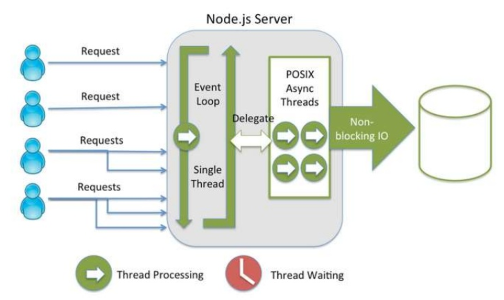
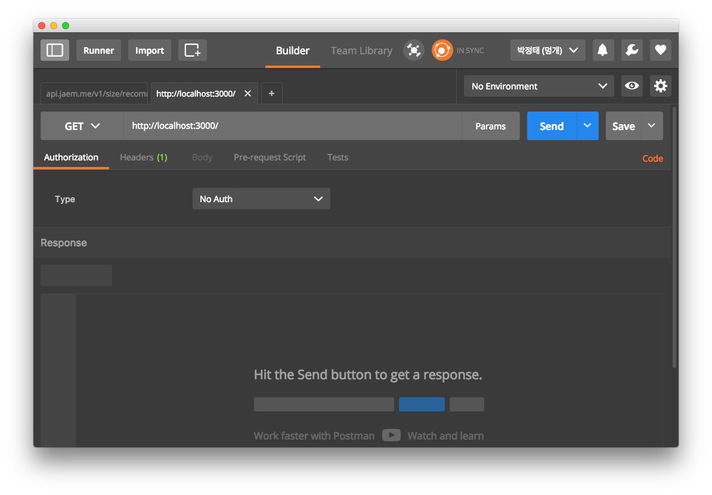
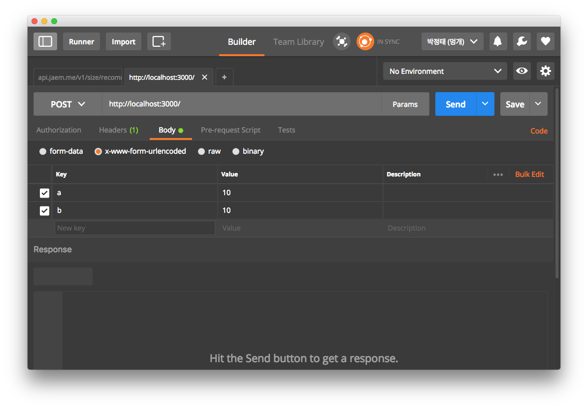

# 3주차 강의

node.js 3주차 강의자료.

## 목차

1. node.js
    
    1.1. 비동기 처리 및 콜백의 깊은이해
    
    1.2. fs를 이용하여 파일 다뤄보기
    
2. javascript 데이터 타입
    
    2.1 array
     
    2.2 json
    
3. node.js
    
    3.1 request, response 객체에 대해서
     
    3.2 jade 다뤄보기
    
    
## 1. node.js

### 비동기 처리 및 콜백의 깊은이해



해당 내용은 ppt를 참고

### fs 모듈을 이용한 예시

* `fs_1.js`

```javascript

var fs = require('fs');


console.log('before');



fs.readFile('file.txt', function(err, data){

    if(err) {
        console.log(err);
    }else{

        console.log(data);
    }

});



console.log('success');
```

```bash
$ node fs_1.js
before
success
test1
test2
test3
test4
```

fs.readFile은 파일을 읽는 모듈입니다.file.txt를 읽은 후 다 읽었을 때 콜백 함수를 실행합니다.

하지만 node는 fs.readFile이 파일을 다 읽을 때까지 기다리지 않고 그 다음 코드를 실행합니다.
 
## 2. javascript 데이터 타입

### 2.1. array

`키워드` : []

* `array.js`

```javascript
var array_test = ['1', '2', '3', '4']

console.log(array_test[0]);
console.log(array_test[1]);
console.log(array_test[2]);
console.log(array_test[3]);

console.log(array_test[array_test.length-1]);

array_test.push('10');
array_test.push('11');

console.log(array_test);
console.log(array_test.pop());
console.log(array_test.pop());

for(var index in array_test){
    console.log(index, array_test[index])
}

array_test.map(function(item, index){
    console.log(index, item)
});
```

```bash
$ node array.js
1
2
3
4
4
[ '1', '2', '3', '4', '10', '11' ]
11
10
0 1
1 2
2 3
3 4
0 '1'
1 '2'
2 '3'
3 '4'
```

### 2.2. json

`키워드` : {}

* `json.js`

```javascript
var json = {key1: 1, key2: [1,2,3,], key3:{ a: 12}};
console.log(json);

console.log(json['key1'])
console.log(json['key2'])
console.log(json['key3'])
console.log(json['key3']['a'])
```

```bash
{ key1: 1, key2: [ 1, 2, 3 ], key3: { a: 12 } }
1
[ 1, 2, 3 ]
{ a: 12 }
12
```


## 3. node.js

### 3.1 request, response 객체에 대해서

request와 response 객체는 클라이언트로 부터 요청이 들어올때 발생하는 이벤트의 콜백 함수가 첫번째, 두번째 인자로 받는 인자입니다.

* `./routes/파일`

```javascript
router.get('/', function(req, res, next) {
    
});
```

콜백 함수의 첫번째 인자가 request, 두번째 인자가 response 객체를 인자로 받게 됩니다.

request를 req로 response를 res로 줄여서 사용을 하겠습니다.(이것들도 변수 이름이니 본인이 편한대로 바꿔서 사용해도 됩니다.)

req 객체에는 클라이언트로부터 요청된 데이터가 포함이 되는 객체입니다.

res 객체는 서버로 부터 클라이언트에게 응답을 할 수 있는 객체입니다.

### 3.2 클라이언트가 서버에게 데이터를 전송하는 방법

* 대표적인 request method

    1. GET    : 데이터 요청
    2. POST   : 데이터 추가
    3. PUT    : 데이터 수정
    4. DELETE : 데이터 삭제

> 요청, 추가, 수정, 삭제를 CRUD라고 표현을 함 create, read, update, delete

---

* 데이터 포함 방법

`첫번째 방법`

쿼리 스트링에 포함시켜서 전송

http://127.0.0.1:3000/test?a=10&b=20&c=30

? 뒤쪽의 구문을 쿼리스트링이라고 합니다. `변수=데이터&변수=데이터`의 형태로 작성이 됩니다.

이때 각각의 변수=데이터를 구분짓기 위해 **`&`** 가 포함이 됩니다.

```javascript
router.get('/', function(req, res, next) {
    console.log(req.query);
    console.log(req.query['a']);
    console.log(req.query['b']);
    res.send('query success');
});
```

`두번째 방법`

두번째 방법은 body에 포함을 시켜서 보내는 방법입니다.

이 경우 웹에서 테스트를 직접 하기 복잡하기 때문에 postman이라는 크롬 확장 프로그램을 이용할것입니다





주소 옆에 post를 선택을 해주고 아래에 body를 선택한 후 x-www-form-urlencoded를 눌러주어 key value에 전송할 데이터를 넣어줍니다.

send를 눌러주면 해당 url로 post 요청을 하게 됩니다.

```javascript
router.post('/', function(req, res, next) {
    console.log(req.body)
    console.log(req.body['a'])
    console.log(req.body['b'])
    res.send('body success')
});
```

`세번째 방법`

세번째는 url path 자체에 실어서 보내는 방법

http://127.0.0.1:3000/10/20

```javascript
router.get('/:a/:b', function(req, res, next) {
    console.log(req.params);
    console.log(req.params['a']);
    console.log(req.params['b']);
    res.send('params success');
});
```

### jade 다뤄보기

* './views/test.jade'

```jade
doctype html
html(lang="en")
body
    h1 Jade - node template engine
    
    div.col#container
        p You are amazing
        p Jade is a terse and simple

        - for (var i = 0; i < 10; ++i) {
          p #{i}
        - }
```

jade는 <>을 사용하지 않습니다.

<>를 사용하지 않고 ()으로 속성들을 표현합니다.

단, class와 id같은 경우는 ()에 넣어도 되지만 .으로 class를 #으로 id를 표현을 하기도 합니다.

jade는 extend를 이용하여 똑같이 반복되는 레이아웃을 분리를 하여 작성할 수 있습니다.

* `./views/layout.jade`

```jade
doctype html
html
  head
    title= title
    link(rel='stylesheet', href='/stylesheets/style.css')
    
  body

    block content
```

* `index.jade`

```jade
extends layout

block content
  h1= title
  p Welcome to #{title}
```

extends를 이용하여 다른 jade 파일을 불러옵니다. 이때 layout에 있는 block content가 index에 있는 block content로 코드가 바꿔치기 됩니다.

즉 index.jade를 html로 변환되기 전 아래와 같이 jade 코드가 생성이 됩니다.

* `./views/index.jade`가 호출되고 바뀐 코드

```jade
doctype html
html
  head
    title #{title}
    link(rel='stylesheet', href='/stylesheets/style.css')
    
  body
      h #{title}
      p Welcome to #{title}
```

이러한 형태로 바뀝니다. 

jade는 `res.render()`를 이용하여 html로 변환을 한 후 클라이언트에게 제공을 합니다.


### res.render를 이용하여 jade사용

* `./routes/index.js`

```javascript
router.get('/jadetest1', function(req, res, next) {
    res.render('test', {});
});

router.get('/jadetest2', function(req, res, next) {
    res.render('test', {title: 'jade test'});
});
```

res.render는 2개의 인자를 넘기게 됩니다 첫번째는 views에 있는 jade 파일

두번째 인자는 jade 파일에서 사용할 데이터를 json 형태로 넘깁니다.
 
해당 json 데이터는 *`#{}`*의 형태로 작성을 합니다


> 여기서 .jade와 ./views를 명시를 하지 않는 이유는 바로 app.js 파일 14, 15줄에서 jade와 views 디렉토리를 사용하겠다고 설정을 했기 떄문입니다.